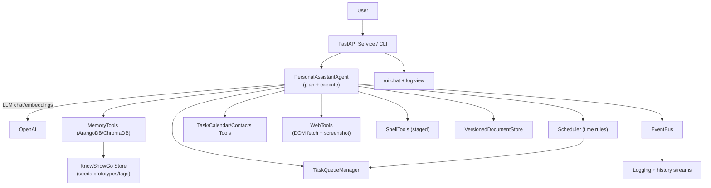

# OSL Agent Prototype

Lightweight personal assistant agent that plans with OpenAI, executes tool calls (tasks, calendar, contacts, web, shell), and persists semantic memory in ChromaDB or ArangoDB with a small KnowShowGo (KSG) ontology.

## Purpose & Goals
- Run a loop that classifies intent, searches semantic memory, plans with an LLM, executes tool calls, and writes back results.
- Keep knowledge in a graph + embeddings store (Arango/Chroma) with seeded prototypes (Task, Event, DAG, List, Tag, etc.) for reuse and RAG.
- Support asynchronous-style event emission, task queueing, and time-based rules (scheduler) so the agent can react to conditions.
- Provide web/vision hooks (DOM HTML + screenshot + bounding-box queries) and shell commandlets for automation planning.
- Keep implementations swappable (mock vs. real) for fast iteration and testing; expose a simple HTTP UI for chat + logs.

## Architecture

## Components
- `src/personal_assistant/agent.py`: Core loop (intent → memory search → LLM JSON plan → tool execution → memory upserts + queue enqueue).
- `src/personal_assistant/chroma_memory.py` / `arango_memory.py`: `MemoryTools` backed by ChromaDB or ArangoDB (graph + embeddings).
- `src/personal_assistant/ksg.py`: Minimal KSG store that seeds property defs, prototypes (List, DAG, Tag, etc.), and seed objects (self/assistant/home/work/language).
- `src/personal_assistant/task_queue.py`: Prioritized queue with enqueue/update operations that also persist to memory.
- `src/personal_assistant/scheduler.py`: Time-rule evaluator that enqueues tasks (optionally with DAG payloads) and persists them with embeddings.
- `src/personal_assistant/versioned_document.py`: Versioned JSON metadata store linked to concepts with embeddings and version chains.
- `src/personal_assistant/web_tools.py`: DOM fetch + screenshot + (mocked) bounding-box locator for vision-guided clicks/xpaths.
- `src/personal_assistant/prompts.py`: System/developer prompts that define the planning contract and tool catalog (tasks, calendar, contacts, web, shell, queue).
- `src/personal_assistant/service.py`: FastAPI service exposing `/health`, `/chat`, `/history`, `/logs`, and a lightweight `/ui` for chat + log viewing.
- `src/personal_assistant/logging_setup.py`: Structured logging configured for console and JSON log streaming to the service.
- `src/personal_assistant/tools.py`, `mock_tools.py`: Abstract tool interfaces + in-memory mocks for fast testing.
- `src/personal_assistant/cpms_adapter.py`: Thin wrapper around the published `cpms-client` package (no local cpms repo needed).
- `main.py`: Demo entrypoint that prefers Arango, then Chroma, then in-memory mock.

## Setup (Poetry)
1) Install dependencies with Poetry:
   - `poetry install`
   - For web/vision tooling: `poetry run playwright install --with-deps chromium`
2) Environment (put these in `.env.local` — no quotes):
   - `OPENAI_API_KEY=your-key`
   - optional `OPENAI_CHAT_MODEL` and `OPENAI_EMBEDDING_MODEL` (defaults: `gpt-4o`, `text-embedding-3-large`)
3) Optional Arango memory:
   - `ARANGO_URL`, `ARANGO_DB`, `ARANGO_USER`, `ARANGO_PASSWORD`
   - `ARANGO_VERIFY` set to a CA bundle path for cloud CAs (do **not** commit certs). Use `false` only for local dev.
4) Optional local embeddings (no OpenAI needed):
   - Run `./scripts/install_local_embedder.sh` once (installs `sentence-transformers`).
   - Set `EMBEDDING_BACKEND=local`; optionally `LOCAL_EMBED_MODEL` to force a specific model, or `LOCAL_EMBED_DIM` to control the hash-fallback size.
5) Run the demo: `python main.py` (prefers Arango → Chroma at `.chroma/` → in-memory mock).
6) Run tests: `poetry run pytest` (a conftest pins the repo root on `sys.path`; currently 90+ passing tests, env-guarded for Playwright/Arango).
7) Run the HTTP service: `uvicorn src.personal_assistant.service:main --reload` or `poetry run agent-service`. Open `http://localhost:8000/ui` for chat/logs/runs tabs.

## Current State
- Agent loop exercises tasks/calendar/contacts/web tools with mock backends and logs lifecycle events via an event bus.
- Semantic memory can be Arango or Chroma; KSG seeds property defs, prototypes (List/DAG/Tag) and seed objects, plus tag helper linking to language.
- Time-based scheduler enqueues tasks with optional DAG payloads and writes embeddings.
- Shell commandlet exists (mocked execution for now) and is exposed in the prompt/tool registry.
- Web DOM fetch + screenshot + bounding-box locator (locator currently mocked; Playwright stub raises NotImplemented).
- FastAPI service streams chat history and event logs; lightweight `/ui` renders chat + log panes.
- Versioned document store and task queue updater have unit coverage; service and agent have integration tests.

## Known Gaps / Next Steps
- Promote the shell commandlet from mock to a real sandboxed executor with staging/confirmation.
- Flesh out Playwright/Appium flows (HTML + screenshot + vision queries + click/fill) and add end-to-end coverage.
- Push more logic into KSG: materialize more property defs/prototypes (Contact/Message/PreferenceRule), cache flattening, and Arango vector indexes.
- Persist event/log streams to storage and broaden the UI to show live streams + memory/task views.
- Add richer RAG prompts so the agent can synthesize/reuse stored DAG procedures (e.g., LinkedIn recruiter workflows) and learn from prior embeddings.
- Split the KSG module into its own package when ready (per goal of carving it into a subproject).
- Evaluate hosting options for local LLMs: free persistent GPU endpoints are effectively unavailable; small CPU models (4/5-bit 7–8B) are slow on free-tier Oracle/Ampere. Plan for paid hosted GPUs (HF/Together/etc.) or larger self-hosted hardware when moving off OpenAI.
- Comms roadmap: add Twilio (SMS/voice) support and a TTS/STT pipeline. Consider integrating with an Asterisk/voice service API to enable automated outbound calls and logging of call transcripts.

## Development Roadmap / Not Yet Implemented
- Production-grade Playwright/Appium flows with retries/timeouts and real vision-assisted locators; live end-to-end tests beyond fixtures.
- Sandbox/confirmation-backed shell executor (the current real executor runs commands directly).
- Secrets/vault hardening (encryption at rest, scoped access) beyond the current Credential/FormData prototypes.
- Ontology workbench UI for browsing/editing concepts, tags, and prototypes; richer run replay with embedded screenshots/DOM.
- Native Arango vector indexes/AQL scoring (currently client-side cosine) and cache flattening for fast queries.
- Live CPMS integration test hitting a real endpoint (adapter is wired, but test falls back to fake without env).
- Deployment hardening (Docker, auth/SSO, metering/billing hooks).

## Version History (high level)
- Added KSG seeds: DAG/List/Queue/Procedure/Step/Tag, plus vault/credential/identity/payment/form data prototypes and properties.
- Added ProcedureBuilder (create/search) with procedure reuse in agent planning.
- Added CPMS adapter and tools; agent supports cpms.* calls.
- Added form autofill (form.autofill) backed by stored FormData/Identity/Credential/PaymentMethod.
- Added real shell executor (staged vs execute) alongside mock.
- Added Playwright captures for web actions and run replay endpoints/UI (chat/logs/runs tabs).
- Added semantic memory “remember” tool with embedding enforcement and credential recall tests.
