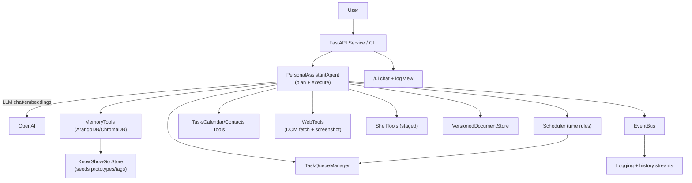

# OSL Agent Prototype

Lightweight personal assistant agent that plans with OpenAI, executes tool calls (tasks, calendar, contacts, web, shell), and persists semantic memory in ChromaDB or ArangoDB with a small KnowShowGo (KSG) ontology.

## Purpose & Goals
- Run a loop that classifies intent, searches semantic memory, plans with an LLM, executes tool calls, and writes back results.
- Keep knowledge in a graph + embeddings store (Arango/Chroma) with seeded prototypes (Task, Event, DAG, List, Tag, etc.) for reuse and RAG.
- Support asynchronous-style event emission, task queueing, and time-based rules (scheduler) so the agent can react to conditions.
- Provide web/vision hooks (DOM HTML + screenshot + bounding-box queries) and shell commandlets for automation planning.
- Keep implementations swappable (mock vs. real) for fast iteration and testing; expose a simple HTTP UI for chat + logs.

## Architecture

## Components
- `src/personal_assistant/agent.py`: Core loop (intent → memory search → LLM JSON plan → tool execution → memory upserts + queue enqueue).
- `src/personal_assistant/chroma_memory.py` / `arango_memory.py`: `MemoryTools` backed by ChromaDB or ArangoDB (graph + embeddings).
- `src/personal_assistant/ksg.py`: Minimal KSG store that seeds property defs, prototypes (List, DAG, Tag, etc.), and seed objects (self/assistant/home/work/language).
- `src/personal_assistant/task_queue.py`: Prioritized queue with enqueue/update operations that also persist to memory.
- `src/personal_assistant/scheduler.py`: Time-rule evaluator that enqueues tasks (optionally with DAG payloads) and persists them with embeddings.
- `src/personal_assistant/versioned_document.py`: Versioned JSON metadata store linked to concepts with embeddings and version chains.
- `src/personal_assistant/web_tools.py`: DOM fetch + screenshot + (mocked) bounding-box locator for vision-guided clicks/xpaths.
- `src/personal_assistant/prompts.py`: System/developer prompts that define the planning contract and tool catalog (tasks, calendar, contacts, web, shell, queue).
- `src/personal_assistant/service.py`: FastAPI service exposing `/health`, `/chat`, `/history`, `/logs`, and a lightweight `/ui` for chat + log viewing.
- `src/personal_assistant/logging_setup.py`: Structured logging configured for console and JSON log streaming to the service.
- `src/personal_assistant/tools.py`, `mock_tools.py`: Abstract tool interfaces + in-memory mocks for fast testing.
- `main.py`: Demo entrypoint that prefers Arango, then Chroma, then in-memory mock.

## Setup
1) Install dependencies (Poetry or pip):
   - `pip install -r requirements.txt` or `poetry install`
2) Environment (put these in `.env.local` — no quotes):
   - `OPENAI_API_KEY=your-key`
   - optional `OPENAI_CHAT_MODEL` and `OPENAI_EMBEDDING_MODEL` (defaults: `gpt-4o`, `text-embedding-3-large`)
3) Optional Arango memory:
   - `ARANGO_URL`, `ARANGO_DB`, `ARANGO_USER`, `ARANGO_PASSWORD`
   - `ARANGO_VERIFY` set to a CA bundle path for cloud CAs (do **not** commit certs). Use `false` only for local dev.
4) Run the demo: `python main.py` (prefers Arango → Chroma at `.chroma/` → in-memory mock).
5) Run tests: `pytest` (a conftest pins the repo root on `sys.path`; 33 passing, 2 skipped in CI-like runs).
6) Run the HTTP service: `uvicorn src.personal_assistant.service:main --reload` or `poetry run agent-service`.

## Current State
- Agent loop exercises tasks/calendar/contacts/web tools with mock backends and logs lifecycle events via an event bus.
- Semantic memory can be Arango or Chroma; KSG seeds property defs, prototypes (List/DAG/Tag) and seed objects, plus tag helper linking to language.
- Time-based scheduler enqueues tasks with optional DAG payloads and writes embeddings.
- Shell commandlet exists (mocked execution for now) and is exposed in the prompt/tool registry.
- Web DOM fetch + screenshot + bounding-box locator (locator currently mocked; Playwright stub raises NotImplemented).
- FastAPI service streams chat history and event logs; lightweight `/ui` renders chat + log panes.
- Versioned document store and task queue updater have unit coverage; service and agent have integration tests.

## Known Gaps / Next Steps
- Promote the shell commandlet from mock to a real sandboxed executor with staging/confirmation.
- Flesh out Playwright/Appium flows (HTML + screenshot + vision queries + click/fill) and add end-to-end coverage.
- Push more logic into KSG: materialize more property defs/prototypes (Contact/Message/PreferenceRule), cache flattening, and Arango vector indexes.
- Persist event/log streams to storage and broaden the UI to show live streams + memory/task views.
- Add richer RAG prompts so the agent can synthesize/reuse stored DAG procedures (e.g., LinkedIn recruiter workflows) and learn from prior embeddings.
- Split the KSG module into its own package when ready (per goal of carving it into a subproject).
