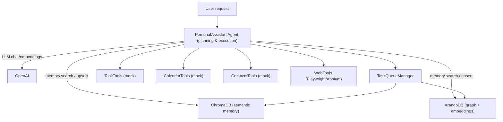

# OSL Agent Prototype

Lightweight personal assistant agent that plans with OpenAI, executes tool calls (tasks, calendar, contacts, web), and persists semantic memory in ChromaDB or ArangoDB.

## Purpose & Goals
- Build a loop that classifies intent, searches memory, plans with an LLM, executes tool calls, and writes back results.
- Maintain a semantic knowledge base so new tasks/events are queryable via embeddings (Chroma-backed RAG).
- Keep implementations swappable (mock vs. real) for fast iteration and testing.
- Enable web interaction via DOM fetch + screenshots for downstream vision-guided actions (clicks, fills).

## Architecture

## Components
- `src/personal_assistant/agent.py`: Core loop (intent classify → memory search → LLM JSON plan → tool execution → memory upserts + queue enqueue).
- `src/personal_assistant/chroma_memory.py`: `MemoryTools` backed by ChromaDB persistent store (`.chroma/` by default).
- `src/personal_assistant/arango_memory.py`: `MemoryTools` backed by ArangoDB graph storage (nodes/edges with embeddings on nodes).
- `src/personal_assistant/mock_tools.py`: In-memory mocks for memory, calendar, tasks, contacts, and web.
- `src/personal_assistant/task_queue.py`: Maintains prioritized task queue node in memory.
- `src/personal_assistant/openai_client.py`: Thin wrapper around OpenAI chat/embeddings with a fake for tests.
- `src/personal_assistant/prompts.py`: System/developer prompts that define the planning contract and tool catalog.
- `src/personal_assistant/web_tools.py`: Playwright-backed primitive web commandlets including DOM fetch + screenshot for vision and selector/xpath/coordinate clicks.
- `main.py`: Demo entrypoint wiring the agent with Chroma memory (fallback to mock if Chroma fails).
- `tests/`: Unit and integration coverage for models, mocks, task queue, and the agent’s happy path.

## Setup
1) Install dependencies (use Poetry or pip):
   - `pip install -r requirements.txt`
   - or `poetry install`
2) Set environment for OpenAI (e.g., in `.env.local`):
   - `OPENAI_API_KEY=...`
   - optionally `OPENAI_CHAT_MODEL` and `OPENAI_EMBEDDING_MODEL` (defaults: `gpt-4o`, `text-embedding-3-large`).
3) Configure optional Arango memory:
   - Set `ARANGO_URL`, `ARANGO_DB`, `ARANGO_USER`, `ARANGO_PASSWORD` to enable Arango-backed memory.
   - If using a custom CA (e.g., ArangoDB Cloud), set `ARANGO_VERIFY` to the CA path (do not commit certs); set to `false` only for local/self-signed dev.
4) Run the demo:
   - `python main.py` (order: Arango if env is set → Chroma at `.chroma/` → in-memory mock).
5) Run tests:
   - `python -m pytest`
6) Run the HTTP service (FastAPI):
   - `uvicorn src.personal_assistant.service:build_app --factory --reload`

## Project History
- Phase 1: In-memory mock tools and OpenAI wrapper with prompts + integration test harness.
- Phase 2 (current): Added ChromaDB-backed semantic memory and repository scaffolding (git + ignore rules).

## Next Up
- Add `queue.update` tool support to align with the prompt contract.
- Expand integration tests (calendar/web flows, failure handling, malformed LLM plans).
- Swap mocks for real task/calendar backends and add persistence for non-embedding fields.
- Harden Playwright/Appium paths with retries, logging, and timeouts.
- Add a ChatGPT + Playwright flow that streams DOM HTML plus screenshot, then issues follow-up clicks/fills driven by LLM function calls.
- Add native Arango vector indexes / AQL scoring to avoid client-side cosine when Arango is available.
